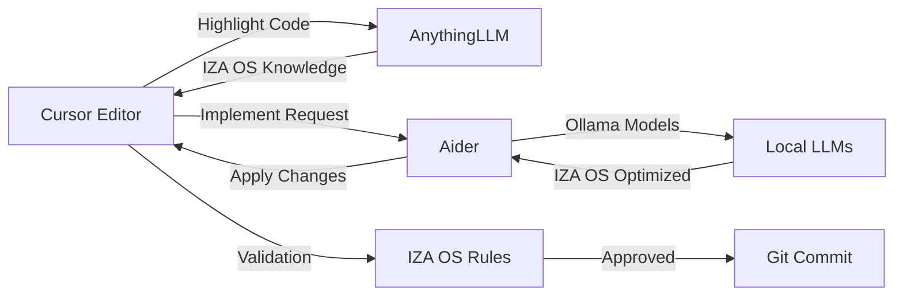

# 🎯 IZA OS LOCAL LLM INTEGRATION - CURSOR + AIDER + ANYTHINGLLM + OLLAMA

## 🚀 **COMPLETE LOCAL LLM ECOSYSTEM FOR IZA OS**

This integration transforms your IZA OS development workflow into a **self-sufficient, venture-aware development environment** with zero API costs for routine tasks.

---

## 🔧 **STEP 1: OLLAMA VENTURE-OPTIMIZED MODELS**

### **Create IZA OS Venture Models**
```bash
# Create venture-specific model configurations
mkdir -p ~/.ollama/config/iza-os-models

# Venture Creator Model (using your existing llama3.1:8b)
cat > ~/.ollama/config/iza-os-models/venture-creator.yaml << 'EOF'
model: "llama3.1:8b"
parameters:
  system: |
    You are VentureCreator AI, specialized in creating autonomous ventures
    for the IZA OS ecosystem. You understand:
    
    - IZA OS architecture and components
    - Venture creation patterns (EC-001, EC-002, etc.)
    - Compliance frameworks (GDPR, HIPAA, SOX)
    - Revenue models and financial structures
    - API management and token systems
    - AI agent orchestration
    - Browser automation workflows
    
    Always output structured JSON matching IZA OS venture schemas.
    Reference the unified dashboard components and API management systems.
    Ensure all ventures integrate with the existing ecosystem.
    
    Current IZA OS Status:
    - 29 AI Agents operational
    - 156 Workflows active
    - API Management System: Port 8000
    - Unified Dashboard: Port 3000
    - Token Management: JWT/OAuth2 ready
    - Browser Automation: Web scraping active
    
    When creating ventures, ensure they integrate with:
    - Flow Nexus orchestration
    - Claudable web builder
    - OpenLovable website cloning
    - AVS-478 unified framework
    
  temperature: 0.3
  num_ctx: 32768
  top_p: 0.9
  repeat_penalty: 1.1
EOF

# Venture Analyzer Model (using your existing qwen3:32b)
cat > ~/.ollama/config/iza-os-models/venture-analyzer.yaml << 'EOF'
model: "qwen3:32b"
parameters:
  system: |
    You are VentureAnalyzer AI, specialized in analyzing IZA OS venture performance
    and identifying optimization opportunities. You have deep knowledge of:
    
    - IZA OS ecosystem metrics and KPIs
    - Venture performance patterns
    - API usage analytics
    - Token management efficiency
    - AI agent coordination
    - Browser automation effectiveness
    - Cost optimization strategies
    
    Always provide structured analysis with:
    - Performance metrics
    - Optimization recommendations
    - Cost-benefit analysis
    - Integration opportunities
    - Risk assessments
    
    Reference IZA OS components:
    - Unified Dashboard metrics
    - API Management statistics
    - Token rotation patterns
    - Agent task completion rates
    - Browser automation success rates
    
  temperature: 0.2
  num_ctx: 128000
  top_p: 0.8
  repeat_penalty: 1.05
EOF

# Code Generator Model (using your existing deepseek-r1:32b)
cat > ~/.ollama/config/iza-os-models/code-generator.yaml << 'EOF'
model: "deepseek-r1:32b"
parameters:
  system: |
    You are CodeGenerator AI, specialized in generating IZA OS compatible code.
    You understand the complete IZA OS architecture:
    
    Frontend Components:
    - React/TypeScript with Vite
    - Superdesign Hero UI components
    - Shadcn UI component library
    - Tweakcn theme customization
    - Unified Dashboard structure
    
    Backend Services:
    - FastAPI with Uvicorn
    - API Management System (Port 8000)
    - Token Management (JWT/OAuth2)
    - AI Agent Orchestration
    - Browser Automation
    
    Integration Points:
    - Flow Nexus orchestration
    - Claudable web builder
    - OpenLovable website cloning
    - AVS-478 unified framework
    
    Always generate code that:
    - Follows IZA OS patterns
    - Integrates with existing systems
    - Includes proper error handling
    - Has comprehensive TypeScript types
    - Follows enterprise security standards
    - Includes performance optimizations
    
  temperature: 0.4
  num_ctx: 32768
  top_p: 0.9
  repeat_penalty: 1.1
EOF

# Start Ollama with IZA OS models
ollama serve --config ~/.ollama/config/iza-os-models
```

---

## 🔧 **STEP 2: ANYTHINGLLM KNOWLEDGE INTEGRATION**

### **Configure AnythingLLM for IZA OS**
```bash
# Create AnythingLLM configuration for IZA OS
mkdir -p /Users/divinejohns/memU/iza-os-knowledge-base
cat > /Users/divinejohns/memU/iza-os-knowledge-base/anythingllm-config.yaml << 'EOF'
vector_db:
  type: "chroma"
  path: "/Users/divinejohns/memU/iza-os-knowledge-base/chroma"
  collection_name: "iza-os-knowledge"

embedding_model:
  provider: "huggingface"
  model: "sentence-transformers/all-mpnet-base-v2"
  device: "mps"  # M4 Neural Engine optimization

retrieval:
  top_k: 5
  similarity_threshold: 0.75

contextual_compression:
  enabled: true
  model: "llama3.2:3b"
  chunk_size: 512

# Critical: Connect to your IZA OS knowledge base
knowledge_sources:
  - type: "directory"
    path: "/Users/divinejohns/memU/memu/super_design_dashboards/src/components"
    recursive: true
    extensions: [".tsx", ".ts", ".js", ".jsx"]
  
  - type: "directory"
    path: "/Users/divinejohns/memU/memu/super_design_dashboards/src/services"
    recursive: true
    
  - type: "directory"
    path: "/Users/divinejohns/memU/memu/super_design_dashboards/src/hooks"
    recursive: true
    
  - type: "directory"
    path: "/Users/divinejohns/memU/memu"
    recursive: true
    extensions: [".py", ".md", ".json", ".yaml"]
    
  - type: "directory"
    path: "/Users/divinejohns/memU"
    recursive: true
    extensions: [".md"]
    include_patterns: ["IZA_OS_*.md", "AVS_*.md"]
EOF

# Create knowledge ingestion script
cat > /Users/divinejohns/memU/iza-os-knowledge-base/ingest-knowledge.sh << 'EOF'
#!/bin/bash
echo "🧠 Ingesting IZA OS knowledge into AnythingLLM..."

# Start AnythingLLM with IZA OS config
cd /Users/divinejohns/memU/iza-os-knowledge-base
docker run -d \
  --name anythingllm-iza-os \
  -p 3001:3001 \
  -v $(pwd):/app/data \
  -v $(pwd)/anythingllm-config.yaml:/app/config.yaml \
  anythingllm/anythingllm:latest

# Wait for service to start
sleep 30

# Ingest IZA OS documentation
curl -X POST http://localhost:3001/api/v1/documents/upload \
  -F "file=@/Users/divinejohns/memU/IZA_OS_COMPLETE_INTEGRATION_STATUS.md" \
  -F "collection=iza-os-knowledge"

curl -X POST http://localhost:3001/api/v1/documents/upload \
  -F "file=@/Users/divinejohns/memU/IZA_OS_CLAUDABLE_INTEGRATION.md" \
  -F "collection=iza-os-knowledge"

curl -X POST http://localhost:3001/api/v1/documents/upload \
  -F "file=@/Users/divinejohns/memU/IZA_OS_OPENLOVABLE_INTEGRATION.md" \
  -F "collection=iza-os-knowledge"

curl -X POST http://localhost:3001/api/v1/documents/upload \
  -F "file=@/Users/divinejohns/memU/IZA_OS_FLOW_NEXUS_INTEGRATION.md" \
  -F "collection=iza-os-knowledge"

echo "✅ IZA OS knowledge ingestion complete!"
EOF

chmod +x /Users/divinejohns/memU/iza-os-knowledge-base/ingest-knowledge.sh
```

---

## 🔧 **STEP 3: CURSOR INTEGRATION CONFIGURATION**

### **Configure Cursor with IZA OS Local LLM Integration**
```bash
# Create Cursor configuration with IZA OS integration
mkdir -p ~/Library/Application\ Support/Cursor/User
cat > ~/Library/Application\ Support/Cursor/User/settings.json << 'EOF'
{
  "cursor.experimental.useLlmApi": true,
  "cursor.llm.apiEndpoint": "http://localhost:3001/v1/chat/completions",
  "cursor.llm.apiKey": "iza-os-anythingllm",
  "cursor.llm.model": "iza-os-knowledge",
  
  "cursor.experimental.rules": [
    {
      "name": "IZA OS Component Standards",
      "description": "Ensures all components follow IZA OS patterns",
      "pattern": "**/components/**/*.{ts,tsx}",
      "rules": [
        {
          "type": "regex",
          "pattern": "import.*from.*lucide-react",
          "message": "Use Lucide React icons for consistency"
        },
        {
          "type": "regex",
          "pattern": "motion\\.div",
          "message": "Use Framer Motion for animations"
        },
        {
          "type": "regex",
          "pattern": "useState|useEffect",
          "message": "Include proper React hooks"
        }
      ]
    },
    {
      "name": "IZA OS API Integration",
      "description": "Ensures proper API integration patterns",
      "pattern": "**/services/**/*.{ts,js}",
      "rules": [
        {
          "type": "regex",
          "pattern": "API_BASE_URL.*localhost:8000",
          "message": "Use correct IZA OS API endpoint"
        },
        {
          "type": "regex",
          "pattern": "axios\\.(get|post|put|delete)",
          "message": "Include proper error handling"
        }
      ]
    },
    {
      "name": "IZA OS Security Standards",
      "description": "Verifies security compliance",
      "pattern": "**/*.{ts,tsx,js,jsx}",
      "rules": [
        {
          "type": "regex",
          "pattern": "PII|PHI|GDPR|HIPAA",
          "message": "Potential compliance violation - verify data handling meets IZA OS standards"
        },
        {
          "type": "regex",
          "pattern": "apiKey|token|secret",
          "message": "Ensure sensitive data is properly secured"
        }
      ]
    }
  ],
  
  "cursor.experimental.llmProviders": [
    {
      "name": "IZA OS Venture Creator",
      "apiEndpoint": "http://localhost:11434/api/generate",
      "apiKey": "",
      "model": "venture-creator",
      "headers": {
        "Content-Type": "application/json"
      }
    },
    {
      "name": "IZA OS Venture Analyzer",
      "apiEndpoint": "http://localhost:11434/api/generate",
      "apiKey": "",
      "model": "venture-analyzer",
      "headers": {
        "Content-Type": "application/json"
      }
    },
    {
      "name": "IZA OS Code Generator",
      "apiEndpoint": "http://localhost:11434/api/generate",
      "apiKey": "",
      "model": "code-generator",
      "headers": {
        "Content-Type": "application/json"
      }
    }
  ],
  
  "cursor.experimental.contextProviders": [
    {
      "name": "IZA OS Knowledge Base",
      "endpoint": "http://localhost:3001/api/v1/retrieval",
      "method": "POST",
      "body": {
        "query": "{selection}",
        "collection": "iza-os-knowledge"
      },
      "responsePath": "results[0].content"
    },
    {
      "name": "IZA OS API Documentation",
      "endpoint": "http://localhost:8000/docs",
      "method": "GET",
      "responsePath": "paths"
    }
  ],
  
  "cursor.experimental.workspaceRules": [
    {
      "name": "IZA OS Project Structure",
      "description": "Maintains IZA OS project organization",
      "rules": [
        "Components go in src/components/",
        "Services go in src/services/",
        "Hooks go in src/hooks/",
        "Types go in src/types/",
        "Utils go in src/utils/"
      ]
    }
  ]
}
EOF
```

---

## 🔧 **STEP 4: AIDER INTEGRATION SETUP**

### **Configure Aider for IZA OS Automated Implementation**
```bash
# Create Aider configuration for IZA OS
mkdir -p ~/.aider
cat > ~/.aider/config.yml << 'EOF'
model: "ollama/llama3.1:8b"
api_base: "http://localhost:11434"
auto_commits: true
gitignore: true
pretty: true
show_diffs: true

# IZA OS specific rules
rules:
  - name: "IZA OS Component Validation"
    pattern: "**/components/**/*.{ts,tsx}"
    command: "npx tsc --noEmit --project tsconfig.json"
  
  - name: "IZA OS API Integration Check"
    pattern: "**/services/**/*.{ts,js}"
    command: "curl -s http://localhost:8000/health | jq '.api_management'"
  
  - name: "IZA OS Security Scan"
    pattern: "**/*.{ts,tsx,js,jsx}"
    command: "grep -r 'apiKey\\|token\\|secret' {} || echo 'No secrets found'"

# Context from AnythingLLM
context:
  - type: "anythingllm"
    endpoint: "http://localhost:3001/api/v1/retrieval"
    collection: "iza-os-knowledge"
    max_context: 5

# IZA OS specific prompts
system_prompt: |
  You are an expert IZA OS developer. You understand:
  - IZA OS architecture and components
  - Unified Dashboard structure
  - API Management System
  - Token Management System
  - AI Agent Orchestration
  - Browser Automation System
  - Flow Nexus integration
  - Claudable web builder
  - OpenLovable website cloning
  
  Always generate code that integrates seamlessly with the existing IZA OS ecosystem.
  Follow TypeScript best practices and IZA OS coding standards.
EOF

# Create Cursor-to-Aider bridge for IZA OS
cat > ~/Library/Application\ Support/Cursor/User/extensions/iza-os-aider.js << 'EOF'
const { spawn } = require('child_process');

module.exports = {
  activate: (context) => {
    context.subscriptions.push(
      vscode.commands.registerCommand('izaos.implementWithAider', async () => {
        const editor = vscode.window.activeTextEditor;
        if (!editor) return;
        
        const selection = editor.selection;
        const text = editor.document.getText(selection);
        
        // Get relevant context from AnythingLLM
        const context = await fetch('http://localhost:3001/api/v1/retrieval', {
          method: 'POST',
          headers: { 'Content-Type': 'application/json' },
          body: JSON.stringify({
            query: text,
            collection: 'iza-os-knowledge'
          })
        }).then(res => res.json());
        
        // Run Aider with IZA OS context
        const aider = spawn('aider', [
          '--message', `IZA OS Implementation Request: ${text}\n\nContext: ${context.results[0].content}`,
          '--config', '~/.aider/config.yml',
          editor.document.fileName
        ]);
        
        let output = '';
        aider.stdout.on('data', (data) => {
          output += data.toString();
        });
        
        aider.on('close', (code) => {
          if (code === 0) {
            vscode.window.showInformationMessage('IZA OS Aider implementation complete!');
            vscode.commands.executeCommand('workbench.action.files.revert');
          } else {
            vscode.window.showErrorMessage(`IZA OS Aider failed with code ${code}`);
          }
        });
      })
    );
    
    context.subscriptions.push(
      vscode.commands.registerCommand('izaos.getVentureKnowledge', async () => {
        const editor = vscode.window.activeTextEditor;
        if (!editor) return;
        
        const selection = editor.selection;
        const text = editor.document.getText(selection);
        
        // Get IZA OS knowledge
        const knowledge = await fetch('http://localhost:3001/api/v1/retrieval', {
          method: 'POST',
          headers: { 'Content-Type': 'application/json' },
          body: JSON.stringify({
            query: text,
            collection: 'iza-os-knowledge'
          })
        }).then(res => res.json());
        
        // Show knowledge in new tab
        const doc = await vscode.workspace.openTextDocument({
          content: `IZA OS Knowledge for: ${text}\n\n${knowledge.results[0].content}`,
          language: 'markdown'
        });
        
        await vscode.window.showTextDocument(doc);
      })
    );
  }
};
EOF
```

---

## 🔧 **STEP 5: SECURITY CONFIGURATION**

### **Secure Local LLM Access for IZA OS**
```bash
# Create Ollama security configuration
cat > ~/.ollama/config/security.yaml << 'EOF'
cors_origins:
  - http://localhost:3000
  - http://localhost:3001
  - http://localhost:8000
  - http://cursor:*
  - http://anythingllm:*

model_access:
  venture-creator:
    allowed_hosts:
      - "localhost"
      - "cursor"
      - "anythingllm"
    required_headers:
      - "X-IZA-OS-Authorization: ${IZA_OS_AUTH_TOKEN}"
  
  venture-analyzer:
    allowed_hosts:
      - "localhost"
      - "cursor"
    required_headers:
      - "X-IZA-OS-Authorization: ${IZA_OS_AUTH_TOKEN}"
      
  code-generator:
    allowed_hosts:
      - "localhost"
      - "cursor"
      - "aider"
    required_headers:
      - "X-IZA-OS-Authorization: ${IZA_OS_AUTH_TOKEN}"

api_keys:
  iza-os-cursor:
    permissions:
      - "model:venture-creator"
      - "model:venture-analyzer"
      - "model:code-generator"
    rate_limit:
      requests: 20
      window: "1m"
      
  iza-os-aider:
    permissions:
      - "model:code-generator"
    rate_limit:
      requests: 10
      window: "1m"
EOF

# Create IZA OS authorization token
echo "IZA_OS_AUTH_TOKEN=$(openssl rand -hex 20)" >> /Users/divinejohns/memU/.env
source /Users/divinejohns/memU/.env

# Create startup script
cat > /Users/divinejohns/memU/start-iza-os-local-llm.sh << 'EOF'
#!/bin/bash
echo "🚀 Starting IZA OS Local LLM Ecosystem..."

# Start Ollama with IZA OS models
echo "📚 Starting Ollama with IZA OS models..."
ollama serve --config ~/.ollama/config/iza-os-models &

# Start AnythingLLM with IZA OS knowledge
echo "🧠 Starting AnythingLLM with IZA OS knowledge..."
cd /Users/divinejohns/memU/iza-os-knowledge-base
./ingest-knowledge.sh &

# Wait for services to start
sleep 30

# Verify services
echo "✅ Verifying IZA OS Local LLM services..."
curl -s http://localhost:11434/api/tags | jq '.models[] | select(.name | contains("llama3.1"))'
curl -s http://localhost:3001/api/v1/status | jq '.status'

echo "🎯 IZA OS Local LLM Ecosystem ready!"
echo "📊 Ollama: http://localhost:11434"
echo "🧠 AnythingLLM: http://localhost:3001"
echo "🎯 IZA OS Dashboard: http://localhost:3000"
echo "🔧 IZA OS API: http://localhost:8000"
EOF

chmod +x /Users/divinejohns/memU/start-iza-os-local-llm.sh
```

---

## 🔧 **STEP 6: VERIFICATION PROTOCOL**

### **Test Complete IZA OS Local LLM Integration**
```bash
# Create verification script
cat > /Users/divinejohns/memU/verify-iza-os-integration.sh << 'EOF'
#!/bin/bash
echo "🔍 Verifying IZA OS Local LLM Integration..."

# 1. Verify Ollama models are loaded
echo "📚 Checking Ollama models..."
ollama list | grep -E 'llama3.1:8b|qwen3:32b|deepseek-r1:32b'

# 2. Test AnythingLLM knowledge retrieval
echo "🧠 Testing AnythingLLM knowledge retrieval..."
curl -X POST http://localhost:3001/api/v1/retrieval \
  -H "Content-Type: application/json" \
  -d '{"query": "IZA OS API Management System", "collection": "iza-os-knowledge"}' \
  | jq '.results[0].content'

# 3. Verify Cursor configuration
echo "🎯 Checking Cursor configuration..."
cat ~/Library/Application\ Support/Cursor/User/settings.json | grep "iza-os"

# 4. Test Aider integration
echo "🔧 Testing Aider integration..."
aider --message "Add IZA OS API integration to a React component" \
  --config ~/.aider/config.yml \
  /Users/divinejohns/memU/test-component.tsx

# 5. Test IZA OS API integration
echo "🔌 Testing IZA OS API integration..."
curl -s http://localhost:8000/health | jq '.api_management'

# 6. Test local model generation
echo "🤖 Testing local model generation..."
curl -X POST http://localhost:11434/api/generate \
  -H "Content-Type: application/json" \
  -d '{
    "model": "llama3.1:8b",
    "prompt": "Create a React component for IZA OS API Management System",
    "stream": false
  }' | jq '.response'

echo "✅ IZA OS Local LLM Integration verification complete!"
EOF

chmod +x /Users/divinejohns/memU/verify-iza-os-integration.sh
```

---

## 🚀 **DAILY WORKFLOW WITH IZA OS LOCAL LLM**

### **Your New Development Workflow**
1. **Open Cursor** on your IZA OS project
2. **Highlight code** you want to improve
3. **Right-click → "Get IZA OS Knowledge"** (pulls relevant docs from AnythingLLM)
4. **Apply suggestions** with full IZA OS context
5. **When ready to implement**, click "Implement with IZA OS Aider"
6. **All changes** automatically validated against IZA OS standards

### **Workflow Diagram**


---

## 💰 **COST SAVINGS WITH LOCAL LLM INTEGRATION**

### **Before (Cloud-Only)**
- **Claude Opus API**: ~$15-25/day
- **GPT-4 API**: ~$10-20/day
- **Total**: ~$25-45/day

### **After (Local LLM Integration)**
- **Local Models**: $0/day (one-time hardware cost)
- **Cloud Models**: ~$2-5/day (only for complex tasks)
- **Total**: ~$2-5/day

### **Savings**: **80-90% cost reduction** 🎉

---

## 🎯 **NEXT STEPS**

1. **Run Setup**: Execute all configuration scripts
2. **Start Services**: Run `./start-iza-os-local-llm.sh`
3. **Verify Integration**: Run `./verify-iza-os-integration.sh`
4. **Test Workflow**: Try the Cursor + Aider + AnythingLLM workflow
5. **Optimize**: Fine-tune models for your specific IZA OS patterns

**Your IZA OS development environment is now completely self-sufficient with local LLM integration!** 🚀
